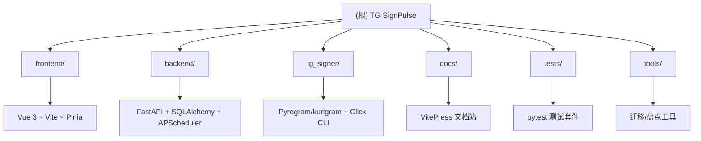

# TG-SignPulse

> Telegram 消息监测系统 — 自动化 Telegram 签到、消息发送、关键词监控、AI 回复等任务的统一管理面板。

## 变更记录 (Changelog)

| 日期 | 版本 |
|------|------|
| 2026-08-11 | v2.3.0：删除旧版 ORM 任务系统，引入 SSE 实时推送与进程内事件总线，新增账号深链、批量检测与命中记录导出，前后端大规模重构与测试补全 |

## 项目愿景

TG-SignPulse 是一个基于 Node.js (Vue 3) + Python (FastAPI) 的 Telegram 自动化任务管理平台，提供 Web 面板统一管理多个 Telegram 账号的定时签到、消息交互、关键词监控和 AI 辅助回复。

当前版本：`tg_signer.__version__` = **2.3.0**。

## 架构总览



### 技术栈

| 层级 | 技术选型 |
|------|----------|
| 前端 | Vue 3 + TypeScript + Vite + Pinia + Tailwind CSS 4 + vue-i18n + PWA |
| 后端 API | FastAPI + SQLAlchemy + APScheduler + Pydantic v1（`<2` 钉死） |
| Telegram 引擎 | Pyrogram / kurigram (`tg_signer` 子包) |
| 数据库 | 默认 SQLite (WAL)；可选 `APP_DATABASE_URL` / `DATABASE_URL`（如 PostgreSQL） |
| 认证 | JWT (HS256) + bcrypt + TOTP (pyotp) |
| 部署 | Docker 多阶段构建 + GHCR + docker-compose |
| 文档 | VitePress 1.6 |
| 测试 | pytest + pytest-asyncio + pytest-cov；前端 vitest |

## 模块索引

| 模块 | 路径 | 语言 | 职责 |
|------|------|------|------|
| 前端面板 | `frontend/` | TypeScript/Vue | Web 管理界面：Dashboard/Accounts/Tasks/Logs/Settings |
| 后端 API | `backend/` | Python | FastAPI REST、任务调度、账号管理、签到执行、关键词监控 |
| Telegram 引擎 | `tg_signer/` | Python | Pyrogram 封装、签到/监控 CLI、配置模型、AI 工具 |
| 文档站 | `docs/` | Markdown/VitePress | 用户指南、部署、架构与运维参考 |
| 测试 | `tests/` | Python | pytest 单元/集成（约 70 个 `test_*.py`） |
| 工具 | `tools/` | Python | 旧表盘点、session 迁移 |
| 脚本 | `scripts/` | Shell/JS | 备份、hooks、文档 agent 资源准备 |

## 运行与开发

### 前置要求

- Python 3.10–3.13（`requires-python = ">=3.10,<3.14"`）
- Node.js **22.23.1**（以 `.nvmrc` 为准；CI 与 Docker 同版本；`engines`: `>=22.23.1 <23`）

### 本地开发

```bash
# 后端 (开发常用 8080；Settings 默认 APP_PORT=3000)
pip install -e ".[dev]"
uvicorn backend.main:app --host 127.0.0.1 --port 8080

# 前端 (端口 3000，代理 /api 到 8080)
cd frontend
npm install
npm run dev

# 文档站 (端口 5173)
npm run docs:dev
```

### Docker 部署

```bash
docker-compose -f docker-compose.panel.yml up -d

# 或使用 GHCR 镜像
docker run -d -p 3000:3000 -v ./data:/data ghcr.io/<owner>/tg-signpulse:latest
```

### 环境变量（常用）

| 变量 | 默认值 | 说明 |
|------|--------|------|
| `APP_HOST` | `127.0.0.1` | 后端监听地址 |
| `APP_PORT` | `3000` | 后端监听端口 |
| `APP_DATA_DIR` | 自动检测 | 数据目录路径 |
| `APP_SECRET_KEY` | 自动生成 | JWT 签名密钥 |
| `APP_ACCESS_TOKEN_EXPIRE_HOURS` | `12` | Token 有效期 |
| `APP_DATABASE_URL` / `DATABASE_URL` | 空 | 非空时覆盖 SQLite 文件库 |
| `ADMIN_PASSWORD` | 随机生成 | 初始管理员密码 |
| `LOG_LEVEL` | `INFO` | 日志等级 |
| `TZ` / `APP_TIMEZONE` | `Asia/Hong_Kong` | 时区 |
| `APP_MONITOR_SHARD` | — | 监听分片 `i/n` |
| `APP_MONITOR_ACCOUNT_ALLOWLIST` | — | 监听账号白名单 |

## 测试策略

- **后端框架**: pytest + pytest-asyncio + pytest-xdist（可选）
- **覆盖门槛**: `pytest-cov` `fail_under = 40`；最近 `coverage.xml` 行覆盖约 **60%**（8647/14318）
- **运行**: 仓库根目录 `pytest`
- **测试目录**: `tests/`（factories / fixtures / mocks / utils）
- **后端用例**: 约 70 个 `test_*.py`（API、服务、runner、keyword_monitor、tg_session、SSE、ops 等）
- **前端**: `frontend/` 下 `npm test`（vitest，约 40 个 `*.spec.ts`）+ `npm run typecheck`

## 编码规范

- **Python**: PEP 8，ruff 静态检查（`line-length=88`，规则集显式 select）
- **TypeScript**: `vue-tsc` 严格模式 + Vite 构建
- **注释**: 简体中文，描述意图与约束
- **提交语言**: 中文 Commit 信息（禁止过程性/AI 署名字眼）
- **文档表述**: CLAUDE 文档与 CHANGELOG 禁止出现「打磨全项目」「10 轮」「迭代」等过程性表述，变更记录只描述具体改动内容

## 关键架构洞察（扫描刷新 2026-08-05）

### tg_signer/core/ 包

`runtime.py` 约 487 行：`BaseUserWorker` 基座 + `UserSigner` 薄组合壳（继承 4 个 Mixin）。`__init__.py` 透传公共符号并触发 `_patched_invoke` 等 monkey-patch。外部仍 `from tg_signer.core import UserSigner`。

| 类/模块 | 位置 | 职责 |
|---------|------|------|
| `BaseUserWorker` | `runtime.py` | 配置加载、登录、消息发送、AI 工具获取 |
| `UserSigner` | `runtime.py` | 签到执行器组合壳 |
| `SignerRunnerMixin` | `signer_runner.py` | `sign_a_chat` / `normal_run` / 调度 / 消息入口 |
| `SignerActionsMixin` | `signer_actions.py` | 点击/发送/AI + wait_for 主循环 |
| `SignerMatchersMixin` | `signer_matchers.py` | 判定、状态标记、等待轮询 |
| `SignerConfigMixin` | `signer_config.py` | CLI 配置、签名记录、聊天缓存 |
| `UserMonitor` | `monitor.py` | 规则匹配 → 转发/推送 → AI 回复 |
| `UserSignerWorkerContext` | `context.py` | 消息缓存、回调答案、停止标志 |

**AI 交互场景（5 种）**：计算题、图片 OCR、图片选按钮、计算后点击、监控回复。

### Client 生命周期（`tg_signer/core/client.py`）

| 符号 | 约行号 | 职责 |
|------|--------|------|
| `Client(BaseClient)` | 196–324 | 引用计数共享、自动重连、session string |
| `get_client()` | 359–410 | 工厂 + 全局 `_CLIENT_INSTANCES` 缓存 |
| `close_client_by_name()` | 411–455 | 强制关闭，含锁超时 |

- 连接：`__aenter__` → ref+1 → 首次连接最多 5 次重试（SQLite 锁退避）
- 断开：`__aexit__` → ref-1 → 归零 stop 并清理全局字典
- 调用：`_patched_invoke` 信号量限流 + FloodWait 指数退避

### backend/utils/ 工具层（13 个业务模块）

| 模块 | 职责 |
|------|------|
| `time.py` | 统一 UTC（含秒精度 Z 后缀） |
| `time_window.py` | HH:MM 时间窗 / 跨午夜（静默时段等） |
| `tg_session.py` | accounts 存储 + 并发信号量 + session/代理解析 |
| `atomic_io.py` | JSON 原子写（锁 + fsync + rename） |
| `task_logs.py` | 流程日志解析 |
| `storage.py` | 数据目录发现/覆盖/回退 |
| `proxy.py` | 代理 URL 标准化 |
| `account_locks.py` | 账号级异步锁 |
| `cache.py` | TTLCache（签到任务列表等） |
| `memory_monitor.py` | RSS 告警 + GC |
| `names.py` / `paths.py` | 存储名校验 / 目录准备 |
| `version_info.py` | 版本解析与远程更新检查 |

> 历史列表走 `sign_task_history_index`；SSE 走 `sign_history_events` 进程内总线（30s 索引兜底）；`memory_monitor` 在 `main` 启动循环。

### tg_signer/config.py（约 473 行）

**迁移链**：`SignConfigV1` → `SignConfigV2` → `SignConfigV3`（当前）

| 模型 | 用途 |
|------|------|
| `SignConfigV3` | chats + sign_at + random_seconds |
| `SignChatV3` | actions 列表 + message_thread_id |
| `SignAction` + 8 子类 | 由 `SupportAction` / `action` 字段区分 |
| `MonitorConfig` / `MatchConfig` | 关键词监控与匹配（exact/contains/regex/all） |

**8 种动作**：发送文本、发送骰子、按文本点键盘、按图片选选项、计算题回复、图片识别回复、计算后点按钮、关键词监听通知。

### 前端结构要点

- **Components**：32 个 `.vue`（基础 UI / accounts / tasks / settings）
- **Composables**：15 个（`useI18n`≈49 引用、`useToast`≈19、`useConfirm`、任务列表/设置/Dashboard 等页面级）
- **Stores**：`auth`、`accounts`、`activeRuns`
- **API**：`frontend/src/lib/api.ts` 为 barrel；实现按域拆分到 `lib/api/*`（auth/accounts/sign-tasks/config/…）

### 签到任务体系（主路径唯一）

| 项 | 现状 |
|----|------|
| 路由 | `/api/sign-tasks`（`sign_tasks_v2.py`）+ `POST /api/batch/sign-tasks` |
| 存储 | JSON 文件（`signs_dir/account/task/config.json`） |
| 服务 | `services/sign_tasks.py` 门面 + runner/history/crud 等拆分模块 |
| 旧版 | `/api/tasks`、ORM Task/TaskLog、`services/tasks.py` **已完全移除** |

失败分类：`backend/services/sign_task_failure.py`（历史 `failure_category`）。  
运维：`/api/ops/scheduled-jobs`、`/backup/*`、`/memory`、`/runtime-status`、`/version`。  
残留旧表盘点：`tools/check_legacy_tasks.py`。  
监听分片：`APP_MONITOR_SHARD=i/n`、`APP_MONITOR_ACCOUNT_ALLOWLIST`。

### 签到 / 监听执行摘要

- **定时/手动签到**：`execute_sign_task` 分阶段流水线（配置 → 账号预检 → 账号锁+冷却 → `BackendUserSigner.run_once` → 历史+通知）；`CancelledError` 不写失败历史。细节见 [`backend/CLAUDE.md`](./backend/CLAUDE.md)。
- **CRUD/聚合**：`SignTaskCrudMixin` + `config_build` / `group`；对话列表 `chats_cache.json`（见 backend 专章）。
- **历史**：JSON 文件 + `_recent_index.jsonl` 轻量索引（SSE/最近列表）；详情仍读原 history。
- **关键词监听**：`KeywordMonitorService._on_message`（seen 去重 → 规则过滤 → 匹配 → 推送/continue）；continue 支持 action 1/2/3/4/5/6/7/9。
- **前端**：Tasks / Accounts / Logs / Dashboard / Settings 全链路见 [`frontend/CLAUDE.md`](./frontend/CLAUDE.md)。
- **CLI**：`tg-signer` 全局选项与子命令表见 [`tg_signer/CLAUDE.md`](./tg_signer/CLAUDE.md)。

### 部署与 CI

| 项 | 说明 |
|----|------|
| 镜像 | 多阶段 `Dockerfile`：Node **22.23.1** 构建前端 → Python **3.12-slim** 装包；静态资源进 `/web`；`HEALTHCHECK` → `/healthz` |
| 编排 | `docker-compose.panel.yml`：数据卷 `./data:/data`，`APP_SCHEDULER_LOCK=1`，探针 `/readyz` |
| CI | `.github/workflows/docker.yml`：`test`（pytest 并行 + 核心 ruff）→ `frontend-test`（typecheck + vitest）→ 多架构 build/push GHCR（`main`/`dev`/`v*`） |
| 文档站 | VitePress，`docs/`；开发端口 5173。模块地图见 [`docs/CLAUDE.md`](./docs/CLAUDE.md) |
| 测试地图 | [`tests/CLAUDE.md`](./tests/CLAUDE.md) |

人类可读架构说明与运维场景：`docs/reference/architecture.md`、`docs/reference/ops.md`（与上表交叉对齐，不重复粘贴实现）。

## AI 使用指引

- 改代码前先读对应模块 `CLAUDE.md`（根 / backend / frontend / tg_signer / docs / tests）
- 跨模块改动需理解 `tg_signer/core/client.py` 生命周期与 `backend/services/` 调用链
- 配置模型：`tg_signer/config.py`；后端适配：`backend/services/sign_tasks.py` 及 `sign_task_*`
- 签到 runner / 历史 / 关键词 continue：优先 `backend/CLAUDE.md` 流水线与监控专章
- 前端 API：`frontend/src/lib/api.ts`（barrel）与 `lib/api/*`；类型：`lib/types.ts`；Tasks 列表见 frontend 专章
- 登录流程：`backend/services/telegram/`（`login_phone` / `login_qr` / `accounts` / `sessions`）
